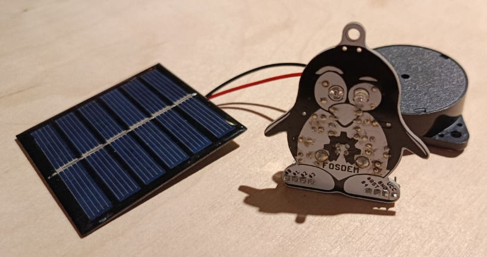

# peewee

a port of the ATtiny13 solarBird firmware to the ATtiny85 based FOSDEM-85.

called peewee the penguin.

# origin

don't miss the analog version:
https://wiki.sgmk-ssam.ch/wiki/Solar_bird

main repo:
https://github.com/schaum/solarBird

randomisation:
https://github.com/fifthepoch/solarBird
